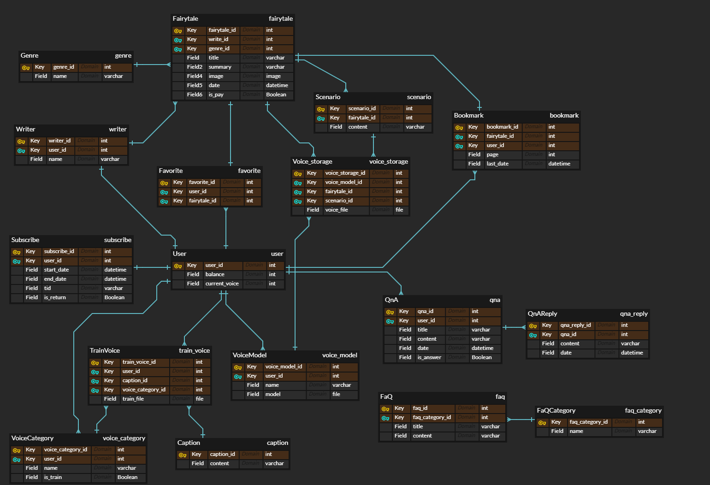
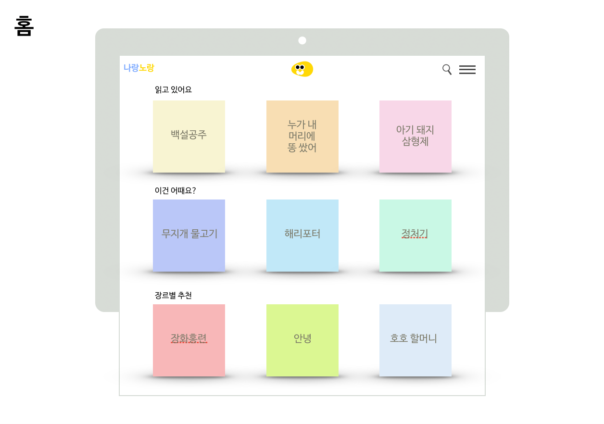
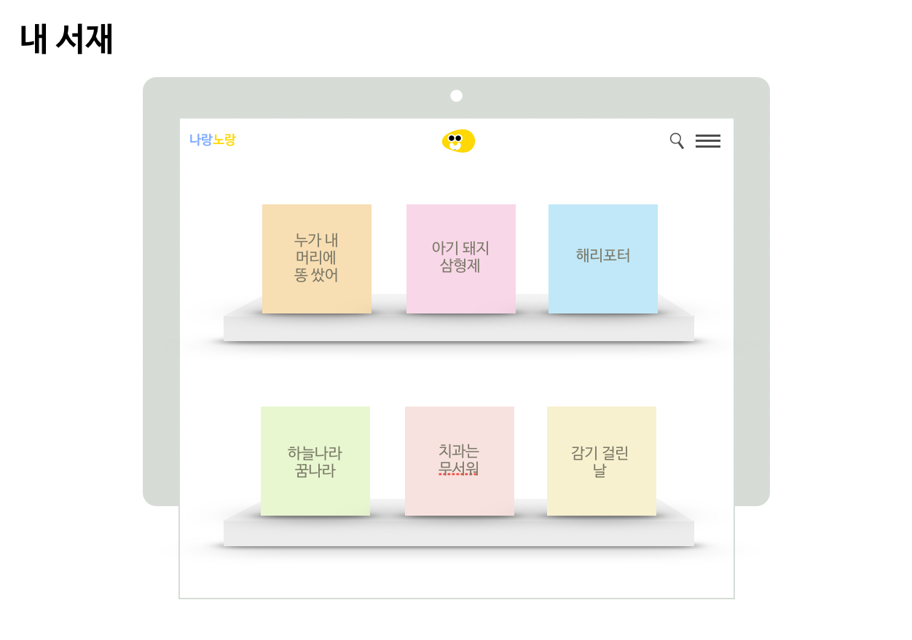

# 나랑노랑

> 팀원 : 김유기(팀장), 강현영, 송은석, 임선빈, 장주환
>
> 개발기간 : 20.09.07 ~ 20.10.08


## 목차

- [개요](#개요)
- [기능](#기능)
- [기술 스택](#기술-스택)
- [향후 계획](#향후 계획)


## 배포주소

https://j3c206.p.ssafy.io


## 개요

TTS 음성합성 기술을 사용하여 부모님의 목소리로 아이에게 동화책을 읽어주는 서비스를 제공하는 것을 목표로 합니다.


## 주요기능
* 소셜로그인(카카오)
* 결제서비스(카카오페이, 구독권)
* 본인만의 음성 모델 만들기
* 학습시킨 음성 모델로 동화책 읽어주기
* 북마크
* 고객센터
  * 1:1 문의 (QnA)
  * 자주 묻는 질문(FaQ)
* 동화책 좋아요 기능


## ERD




## 와이어 프레임








## 기술 스택

* Frontend
  * Vue.js 2.6.11
  * Node.js 12.18.2
  * npm 6.14.5
* Backend
  * django 2.1.15
  * python 3.7.7
  * anaconda 3.7
* Infra
  * docker 19.03.12
  * nginx 1.14.0
  * gunicorn 20.0.4
  * certbot 0.27.0 (https)
* OS
  * Ubuntu 18.04 (AWS EC2)
* DB 
  * mysql 8.0.21
* AI
  * tensorflow 1.13.1
  * tacotron
* Datasets
  * KSS Dataset


## 실행 방법(초기 설정)

- 아나콘다를 이용한 라이브러리 설치

```bash
conda -n [가상환경이름] python=버전
conda activate [가상환경이름] // 가상환경 활성화
conda install git matplotlib scikit-learn tqdm scipy numpy // AI 모델 학습을 위한 라이브러리

conda deactivate // 가상환경 비활성화할때만 사용
```


- pip 라이브러리 설치하기

> backend 폴더로 이동

```bash
pip install -r requirements.txt
```


- backend env 파일 설정하기

> backend/AI_PJT3 폴더로 이동후 .env 파일 생성
>
> 주의 : .env 파일 내부에서는 띄워쓰기를 하지 말아주세요!

```.env
SECRET_KEY=장고 프로젝트 settings.py에 있는 secret_key
DEBUG=True
NAME=설정한 DB 이름
DB_USER=설정한 db 유저
PASSWORD=설정한 DB 비밀번호
HOST=localhost // DB주소 
PORT=3306 // DB 포트
CLIENT_ID=카카오 developers 어플리케이션 client_id // 카카오로그인 관련
SECRET=카카오 developers 어플리케이션 secret key // 카카오로그인 관련
ADMIN_KEY=카카오 developers 어플리케이션 admin_key // 카카오페이 관련
PAY_REDIRECT_URL=카카오페이 API redirect_url // 카카오페이 관련 
PAY_APPROVAL_URL=카카오페이 API approval_url // 카카오페이 관련
```


- DB

> DB가 연결되어 있다면 backend 폴더에서

```bash
python manage.py makemigrations
python manage.py migrate
```

> DB가 연결되어 있지 않다면 MYSQL 설치 후 연동하거나 본인의 입맛에 맞게 DB를 설정하시면 됩니다.
>
> 현재 프로젝트는 MYSQL로 DB가 연동되어있습니다.


- node.js / vue-cli 설치하기

- fronend 라이브러리 설치하기

```
npm install 
```


- frontend env 파일 생성

> frontend 폴더에서 .env.development 생성하기

```.env.development
NODE_ENV = "development"
BASE_URL: "/"
VUE_APP_KAKAO_KEY = 카카오 developers 어플리케이션 javascript key
```


## 로컬 서버 실행

- backend

> backend 폴더에서

```bash
python manage.py runserver
```


- frontend

> frontend 폴더에서

```bash
npm run serve
```


## REST API 문서

> 아래 링크 참조

[REST API 문서](./docs/RESTAPI 명세서.md)


## 추가 문서

> docs 폴더 참조